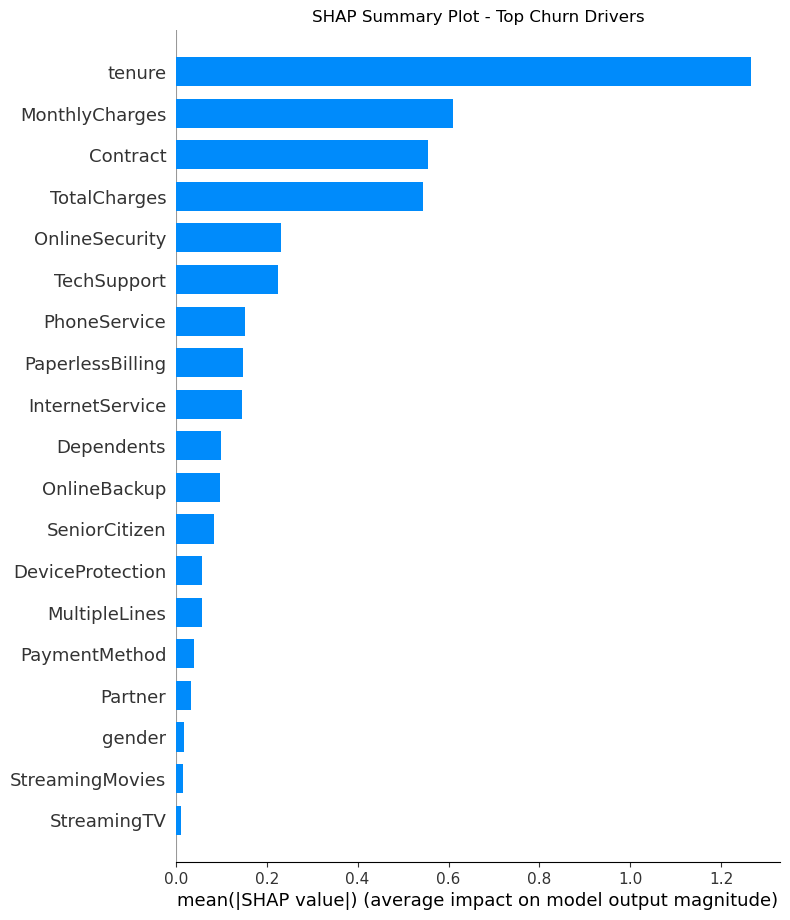

# 📉 Customer Churn Prediction

Predicting whether a customer will churn using machine learning, with a focus on business impact and model explainability using SHAP.

---

## 🚀 Project Overview

Customer churn is a major challenge for subscription-based businesses, directly impacting profitability. This project builds a supervised learning model to predict churn based on customer demographics, service usage, and payment behavior.

---

## 📊 Problem Statement

**Objective**: Predict whether a customer will churn (Yes/No) using behavioral and account-related features.

**Business Impact**: Enables proactive retention strategies like targeted offers, personalized communication, and customer success interventions.

---

## 🛠️ Tech Stack

- **Languages & Libraries**: Python, pandas, scikit-learn, matplotlib, seaborn, SHAP
- **Modeling**: Logistic Regression, Random Forest, SVM
- **Evaluation**: ROC-AUC, Precision, Recall, F1 Score
- **Explainability**: SHAP (SHapley Additive Explanations)
- **Notebooks**: Jupyter (EDA, modeling, SHAP)
- *(Deployment via Flask/Streamlit optional in future)*

---

## 📁 Project Structure

customer-churn-prediction/
├── data/ ← Raw dataset (not included in repo)
├── notebooks/ ← Jupyter notebooks for EDA and modeling
├── src/ ← Modular Python scripts (preprocessing, training)
├── outputs/ ← Figures, metrics, reports
├── requirements.txt ← Python dependencies
└── README.md ← You're here

---

## 🔍 Exploratory Data Analysis (EDA)

- Customers on **month-to-month contracts** are more likely to churn.
- **High monthly charges** correlate with higher churn.
- **Electronic check payment method** is associated with increased churn.
- **Long-tenured customers** are more likely to stay.

Plots created using seaborn and matplotlib can be found in the EDA notebook.

---

## 🧠 Model Development

We trained three classification models:
- Logistic Regression
- Random Forest Classifier
- Support Vector Machine

### 📈 Performance Summary (Test Set)

| Model               | Accuracy | Precision | Recall | F1 Score | ROC AUC |
|---------------------|----------|-----------|--------|----------|---------|
| Logistic Regression | 0.786    | 0.623     | 0.495  | 0.551    | **0.831** |
| Random Forest       | 0.792    | 0.649     | 0.479  | 0.551    | 0.816    |
| SVM                 | **0.795**| **0.665** | 0.457  | 0.542    | 0.784    |

✅ **Logistic Regression was selected as the final model** due to its higher ROC AUC and interpretability.

---

## 🔍 Model Explainability (SHAP)

To improve transparency, we used SHAP (SHapley Additive Explanations) to explain model predictions:

- **Top Churn Drivers**:
  - Contract type (month-to-month)
  - Short customer tenure
  - High monthly charges

  

🔗 [View Interactive Force Plot (HTML)](outputs/figures/shap_force_plot.html)  
This explains why an individual customer is predicted to churn.

---

## 🔮 Future Development

This project can be expanded in the following ways:

- **Hyperparameter Tuning**: Use GridSearchCV or RandomizedSearchCV to optimize model performance.
- **Advanced Models**: Test ensemble methods like XGBoost or Gradient Boosting Machines.
- **Class Imbalance Handling**: Use SMOTE or weighted loss functions to improve recall.
- **Automated Pipeline**: Refactor notebooks into a full pipeline using `train_model.py`, `evaluate_model.py`, etc.
- **Deployment**: Build a web app using **Streamlit** or deploy an API using **FastAPI** to serve predictions.
- **Monitoring & Retraining**: Add model drift monitoring and automate periodic retraining on new data.
- **Dashboard Integration**: Build an interactive dashboard with **Power BI** or **Plotly Dash** for business stakeholders.

---

## 📎 Dataset

- [Telco Customer Churn Dataset – Kaggle](https://www.kaggle.com/datasets/blastchar/telco-customer-churn)

---

## 👤 Author

**Bhargav Somepalli**  
[GitHub](https://github.com/bhargav-s-git) | [LinkedIn](https://www.linkedin.com/in/YOUR-LINKEDIN/)  
*Open to data science collaborations, freelancing, and full-time roles.*

---

## 📜 License

This project is licensed under the **MIT License**.
